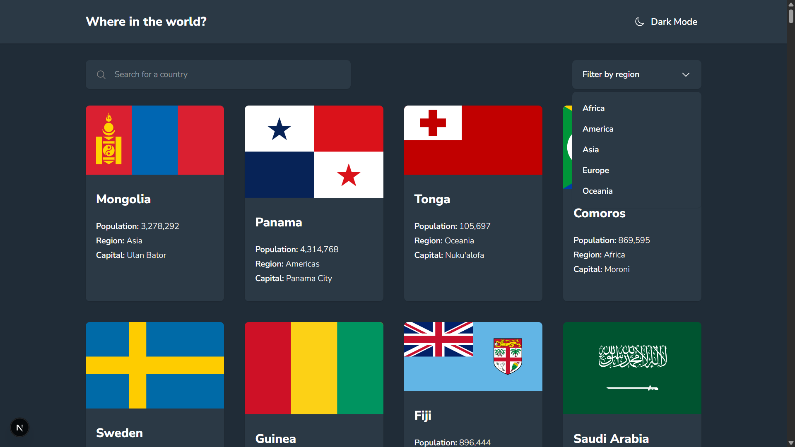
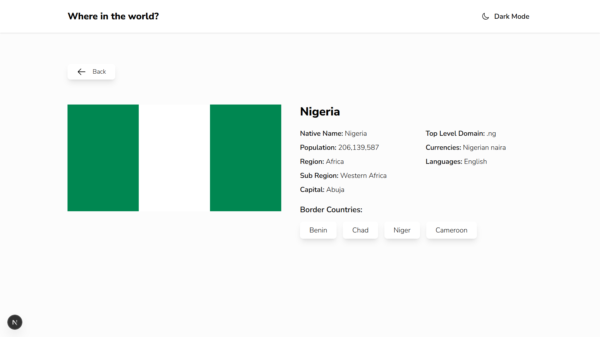

# Frontend Mentor - REST Countries API with color theme switcher solution

This is a solution to the [REST Countries API with color theme switcher challenge on Frontend Mentor](https://www.frontendmentor.io/challenges/rest-countries-api-with-color-theme-switcher-5cacc469fec04111f7b848ca). Frontend Mentor challenges help you improve your coding skills by building realistic projects. 

## Table of contents

- [Overview](#overview)
  - [The challenge](#the-challenge)
  - [Screenshot](#screenshot)
  - [Links](#links)
- [My process](#my-process)
  - [Built with](#built-with)
- [Author](#author)

## Overview

### The challenge

Users should be able to:

- See all countries from the API on the homepage
- Search for a country using an `input` field
- Filter countries by region
- Click on a country to see more detailed information on a separate page
- Click through to the border countries on the detail page
- Toggle the color scheme between light and dark mode *(optional)*

### Screenshot

### Links

- [Solution URL](https://www.frontendmentor.io/solutions/rest-api-countries-with-theme-switcher-next-js-QPHvxIP4Gy)
- [Live Site URL](https://rest-api-countries-pi-hazel.vercel.app/)

## My process

### Built with

- Mobile-first workflow
- [Tailwind CSS](https://tailwindcss.com) - CSS Framework
- [React](https://reactjs.org/) - JS library
- [Next.js](https://nextjs.org/) - React framework
- [Heroicons](https://heroicons.com/) - For icons

## Author

- Frontend Mentor - [@Dev-Dylann](https://www.frontendmentor.io/profile/Dev-Dylann)
- Twitter/X - [@dev_dylann](https://www.x.com/dev_dylann)
